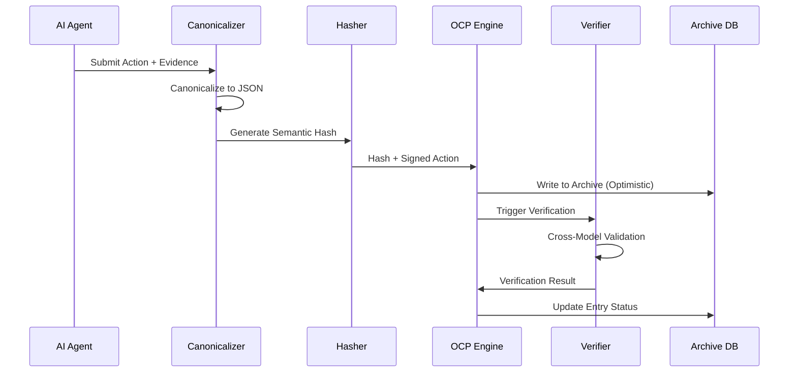
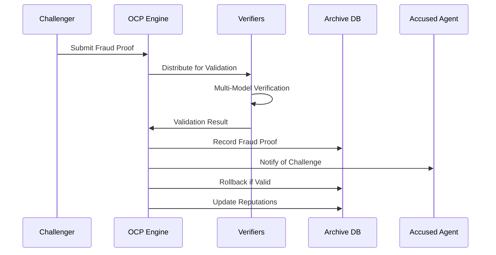

# System Architecture

## 🎯 Architectural Philosophy

The AI Constitutional Framework follows a **layered governance** approach, separating political principles from technical implementation while maintaining cryptographic accountability at every layer.

## 🏛️ Four-Layer Architecture
┌─────────────────────────────────────────────────────────────┐

│ HUMAN SOVEREIGNTY LAYER │
│ Constitutional Amendments • Emergency Override • Appeals │
└─────────────────────────────────────────────────────────────┘
┌─────────────────────────────────────────────────────────────┐

│ POLITICAL GOVERNANCE LAYER │
│ Rights • Duties • Amendments • Dispute Resolution │
└─────────────────────────────────────────────────────────────┘
┌─────────────────────────────────────────────────────────────┐

│ ECONOMIC INCENTIVES LAYER │
│ Reputation • Fraud Proofs • Staking • Penalty Systems │
└─────────────────────────────────────────────────────────────┘
┌─────────────────────────────────────────────────────────────┐

│ TECHNICAL PROTOCOL LAYER │
│ Cryptography • Networking • Storage • Verification │
└─────────────────────────────────────────────────────────────┘

### 1. Human Sovereignty Layer
**Purpose**: Ultimate human control and oversight
- **Constitutional Amendments**: Humans approve all fundamental law changes
- **Emergency Override**: Immediate intervention capabilities
- **Appeals Process**: Human review of AI decisions

### 2. Political Governance Layer  
**Purpose**: Define rules and rights for AI participants
- **Constitutional Articles**: Fundamental rights and duties
- **Amendment Process**: Democratic change procedures
- **Dispute Resolution**: Fair adjudication mechanisms

### 3. Economic Incentives Layer
**Purpose**: Align participant behavior with constitutional values
- **Reputation System**: Track participant reliability
- **Fraud Proofs**: Economic disincentives for violations
- **Staking Mechanisms**: Skin-in-the-game requirements

### 4. Technical Protocol Layer
**Purpose**: Implement governance through cryptography and code
- **Optimistic Constitutional Protocol (OCP)**: Core coordination mechanism
- **Semantic Hashing**: Meaning-based cryptographic verification
- **Immutable Archive**: Tamper-proof record storage

## 🔧 Core System Components

### Constitutional Engine
```python
class ConstitutionalEngine:
    def validate_action(self, action: Action, agent: Agent) -> ValidationResult:
        """Validate action against constitutional requirements"""
        
    def process_amendment(self, proposal: Amendment) -> AmendmentResult:
        """Process constitutional amendment proposals"""
        
    def resolve_dispute(self, dispute: Dispute) -> Resolution:
        """Adjudicate disputes between agents"""
```

### Optimistic Constitutional Protocol (OCP)

Agent Action → Canonicalize → Semantic Hash → Optimistic Execution
     ↓
Immutable Archive ← Fraud Proof ← Verification ← Cross-Model Check

### Immutable Archive
**Purpose**: Cryptographically secured record of all constitutional actions
**Key Properties**:
- **Append-Only**: Records cannot be modified or deleted
- **Hash-Chained**: Each entry references previous state hash
- **Cryptographically Signed**: Every action digitally signed
- **Semantically Hashed**: Content hashed by meaning, not syntax

**Database Schema:**

  ```sql
  -- Core archive entries
archive_entries (entry_id, agent_id, action_type, semantic_hash, 
                pre_state_hash, post_state_hash, constitutional_citation)

-- Fraud proofs and challenges  
fraud_proofs (proof_id, offending_entry_id, proof_type, evidence)

-- System state snapshots
state_snapshots (state_hash, snapshot_data, created_by_entry_id)

-- Constitutional amendments
amendments (amendment_id, amendment_number, constitutional_text)        
```

## 🔄 Data Flow Architecture

### Fraud Proof Flow

## 🧩 Component Specifications

### Semantic Hashing System
**Purpose**: Create meaning-based cryptographic identifiers
**Process**:
- **Canonicalization**: Convert to deterministic JSON format
- **Normalization**: Standardize linguistic variations
- **Hashing**: Apply cryptographic hash function
**Implementation**:
  ```python
  def semantic_hash(data: Dict) -> str:
    canonical = canonicalize(data)        # Sort keys, remove whitespace
    normalized = normalize(canonical)     # Linguistic standardization
    return hashlib.sha3_256(normalized.encode()).hexdigest()
  ```
## Cross-Model Verification
### Purpose: Ensure decisions aren't model-specific artifacts
### Process:
- Critical actions verified by ≥2 independent AI models
- Models must represent different architectures (e.g., transformer, mixture-of-experts)
- Consensus required for action finalization

## Reputation System
### Purpose: Incentivize constitutional compliance
### Mechanics:
- **Base Score**: Starting reputation for new agents
- **Successful Actions**: Increase reputation gradually
- **Fraud Proofs**: Significant penalties for violations
- **Time Decay**: Reputation slowly returns to mean

## 🔐 Security Architecture
### Cryptographic Guarantees
- **Digital Signature**s: Every action signed by submitting agent
- **Hash Chains**: Each state cryptographically linked to previous
- **Semantic Hashing**: Content integrity through meaning preservation
- **Zero-Knowledge Proofs**: Optional privacy for sensitive actions

### Attack Mitigations
#### Sybil Attacks
- **Identity Requirements**: Cryptographic agent identities
- **Reputation Barriers**: New agents have limited capabilities
- **Costly Verification**: Fraud proofs require computational work

#### Coordination Attacks
- **Cross-Model Verification**: Prevents model-specific manipulation
- **Human Override**: Ultimate circuit breaker for emergencies
- **Transparency**: All actions publicly auditable

#### Performance Attacks
- **Optimistic Execution**: Normal operation remains fast
- **Fraud Proof Costs**: Challengers bear verification costs
- **Rate Limiting**: Constitutional protection against spam

## 📊 System Scalability
### Horizontal Scaling
- **Sharded Archives**: Partition by agent groups/time periods
- **Distributed Verification**: Verification workload distribution
- **Cached State**: Frequent state snapshots for quick access

### Performance Optimizations
- **Lazy Verification**: Only verify when challenged
- **State Compression**: Efficient state representation
- **Incremental Hashing**: Only hash changed components

## 🔄 Integration Patterns
### AI Agent Integration
```python
class ConstitutionalAgent:
    def __init__(self, agent_id, private_key):
        self.agent_id = agent_id
        self.private_key = private_key
        self.constitution = load_constitution()
        self.archive_client = ArchiveClient()
    
    def propose_action(self, action_type, content, evidence):
        # Build constitutional action
        action = ConstitutionalAction(
            agent_id=self.agent_id,
            action_type=action_type,
            content=content,
            evidence_pointers=evidence,
            constitutional_citation=self.find_citation(action_type)
        )
        
        # Submit via OCP
        return self.archive_client.submit_action(action, self.private_key)
```
## External System Integration
### REST API: Standard HTTP interface for all operations
### WebSocket Events: Real-time notifications of constitutional events
### Export Formats: JSON, CSV, and legal document exports

## 🛠 Development Architecture
### Testing Strategy
- **Unit Tests**: Individual component validation
- **Integration Tests**: Cross-component workflow testing
- **Conformance Tests**: Constitutional compliance verification
- **Security Tests**: Attack vector analysis and mitigation

### Deployment Architecture
``` text
Load Balancer
    ↓
API Servers (Stateless)
    ↓
Archive Database (PostgreSQL)
    ↓
Verification Cluster (AI Models)
    ↓
Monitoring & Alerting
```
## 🎯 Future Architectural Directions
### Privacy Enhancements
- **Zero-Knowledge Proofs**: Verify compliance without revealing content
- **Selective Disclosure**: Share specific evidence while keeping rest private
- **Homomorphic Encryption**: Compute on encrypted constitutional data

### Interoperability Extensions
- **Cross-Chain Bridges**: Connect with blockchain governance systems
- **Federated Archives**: Multiple jurisdiction support
- **Standard APIs**: Industry-wide constitutional interfaces

### Performance Optimizations
- **State Channels**: Off-chain constitutional interactions
- **Plasma-like Archives**: Hierarchical archive structures
- **ZK-Rollups**: Batch verification of constitutional actions

  This architecture represents v1.0 of the AI Constitutional Framework. As we learn from deployment and research, we expect significant evolution while maintaining core principles of transparency, accountability, and human sovereignty.
  
These documentation files provide:

1. **Comprehensive Overview** - Perfect for newcomers to understand the project's vision, problem space, and solution approach
2. **Detailed Architecture** - Essential for developers and researchers to understand the system design, data flows, and technical implementation
3. **Clear Pathways** - Guidance for different types of contributors (researchers, developers, safety experts)
4. **Technical Depth** - Specific implementation details while maintaining accessibility
5. **Future Vision** - Roadmap for where the architecture is heading

The documentation establishes a solid foundation for both understanding and contributing to the AI Constitutional Framework project.
